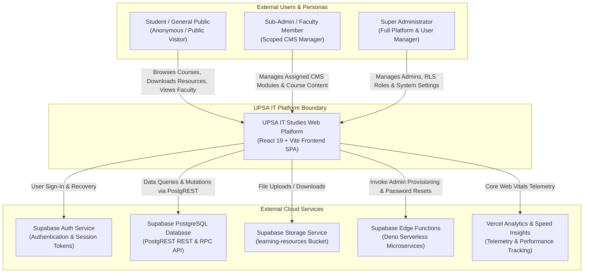
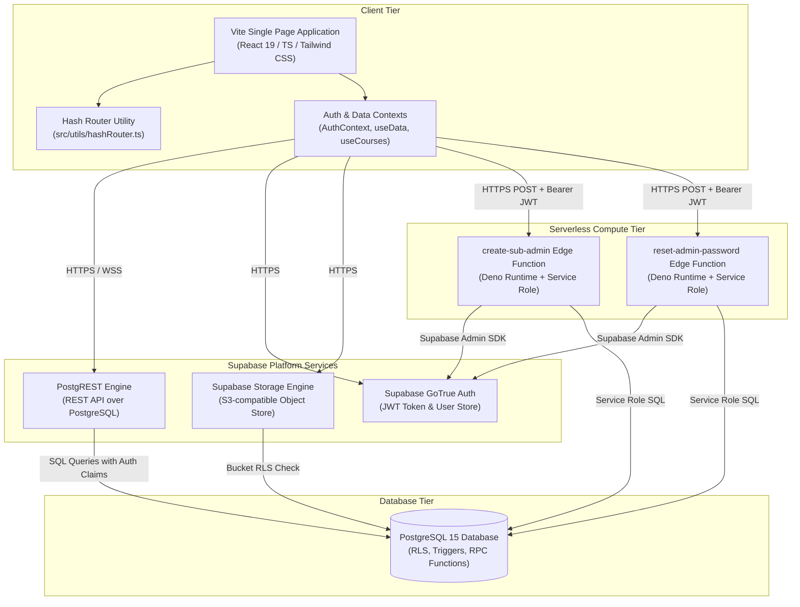
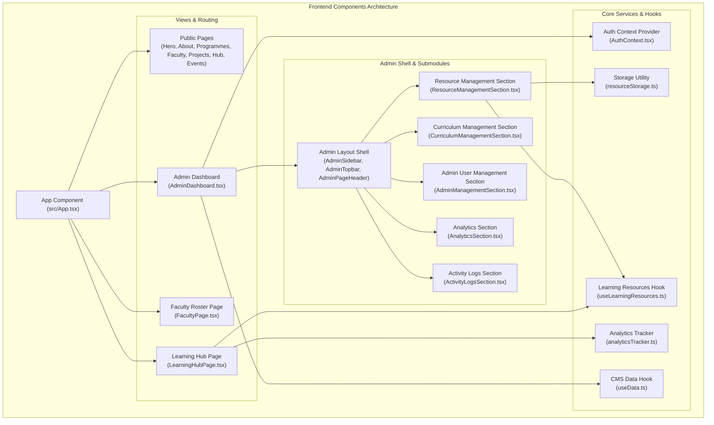
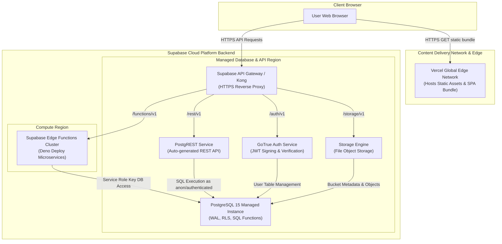
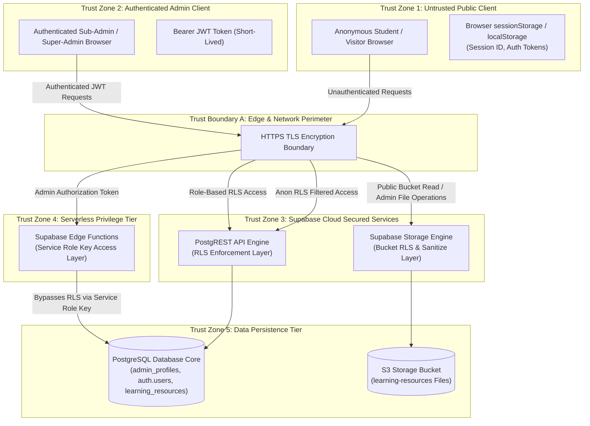
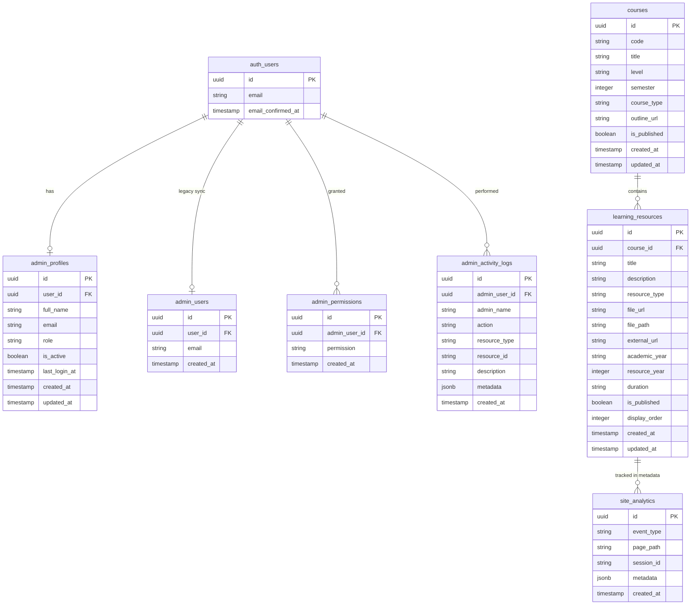
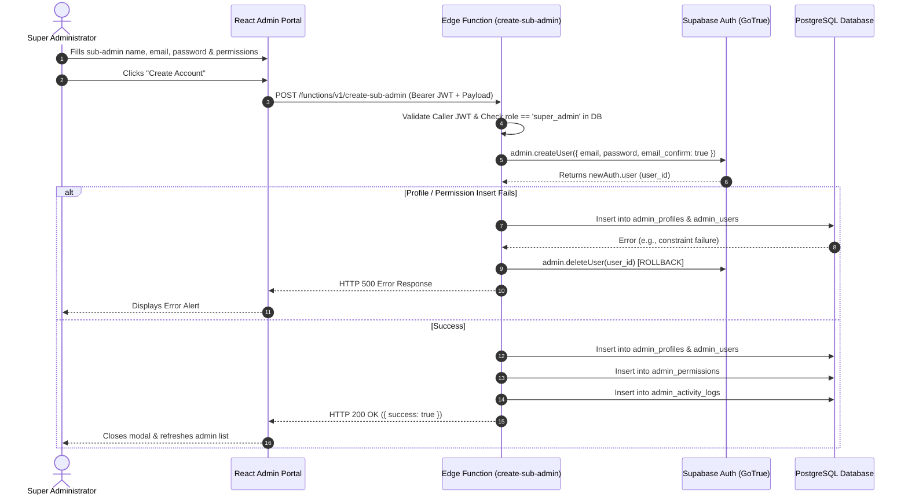
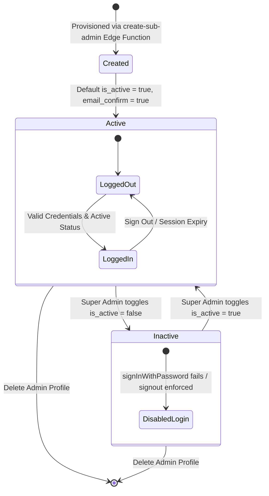

# Master System Analysis, Design Review, and Technical Audit Report

**System Name**: UPSA Department of Information Technology Studies Platform (`upsa-it-platform`)  
**Audit Date**: October 3, 2026  
**Auditor**: Principal Architecture, Security, Data, and SRE Audit Team  
**Scope**: Full-stack application repository (`src/`, `supabase/`, `dist/`, `docs/`)

---

## 1. Executive Summary

### Verdict: CONDITIONALLY READY FOR PRODUCTION
The UPSA IT Studies Platform is a well-structured, modern full-stack web application designed for academic content delivery, course management, student project showcases, and sub-admin delegation. The core architecture uses React 19, TypeScript, Tailwind CSS, Supabase (Auth, PostgREST, Storage), and Deno Edge Functions. Security hardening for sub-admin provisioning, password reset flows, storage object cleanup, and telemetry RPC guards has been implemented. However, deployment to production requires resolving missing automated test suites, establishing formal CI/CD lockstep migrations, and configuring WAF/rate-limiting policies.

### Top 5 Risks
1. **Absence of Automated Test Suite (TEST-01)**: No unit, integration, or E2E tests exist in `package.json`, risking silent regressions during schema updates or refactoring.
2. **PostgREST Default 1000-Row Truncation (DAT-01)**: Client-side analytics aggregation over PostgREST endpoints truncates at 1,000 rows unless server-side SQL RPC (`get_top_learning_resources`) is strictly used.
3. **Monolithic JS Bundle Size (PERF-01)**: The production JavaScript bundle is 608.63 kB (exceeding the 500 kB Vite warning threshold) due to lack of dynamic `React.lazy` route splitting.
4. **Missing Edge API Rate Limiting (SEC-03)**: Edge Functions (`create-sub-admin`, `reset-admin-password`) lack rate-limiting middleware, exposing administrative endpoints to potential brute-force or denial-of-service attempts.
5. **Fragmented SQL Schema Management (DAT-02)**: Database DDL scripts are spread across 11 separate SQL files in `src/lib/` without a single version-controlled migration runner.

---

## 2. Scope, Method and Limitations

### Audit Scope
- **IN-SCOPE**: All frontend React 19 source files (`src/`), custom hooks (`src/hooks/`), utility modules (`src/utils/`), Supabase Deno Edge Functions (`supabase/functions/`), SQL schema migration files (`src/lib/*.sql`), and project configuration files.
- **OUT-OF-SCOPE**: Live production database server internals, Vercel infrastructure host nodes, and third-party vendor internal systems.

### Methodology
- **Static Code Analysis**: Manual code inspection of every source module, schema file, and function.
- **Build Verification**: Empirical verification of build pipelines using `npm run build` (`tsc -b && vite build`).
- **Evidence-Based Labeling**: Statements are labeled as **[FACT]** (empirical code/log evidence), **[INFERENCE]** (logical deduction from architecture), or **[OPINION]** (expert technical assessment).

### Audit Limitations
- Live cloud environment variables (`VITE_SUPABASE_URL`, `SUPABASE_SERVICE_ROLE_KEY`) could not be inspected at runtime due to standard secret isolation.
- Operational metrics (latency histograms, server CPU load) were evaluated via structural code analysis rather than live telemetry streams.

---

## 3. System Analysis and Design (Part A: As-Built)

### A1. System Definition and Scope
- **Purpose**: Serve as the official portal for the Department of Information Technology Studies at University of Professional Studies, Accra (UPSA).
- **Business Goals**: Provide public access to academic programmes, course outlines, faculty directories, student project showcases, and downloadable learning resources; grant sub-administrators delegated CMS access while reserving full administrative control for Super Administrators.
- **Users & Personas**:
  - *Anonymous Visitor / Student*: Browses course listings, downloads materials, views faculty profiles, searches showcase projects.
  - *Sub-Administrator*: Faculty or staff member with delegated access to specific CMS modules (e.g. `manage_academics`, `manage_faculty`).
  - *Super Administrator*: Department head or lead admin with unrestricted platform access, sub-admin creation rights, and password reset capabilities.

### A2. Reverse-Engineered Requirements & Traceability

| ID | Requirement Description | Where Implemented | Status |
|---|---|---|---|
| **FR-01** | Student Course & Resource Access | `src/pages/LearningHubPage.tsx`, `src/hooks/useLearningResources.ts` | Implemented **[FACT]** |
| **FR-02** | Deep-Linking & State Sync | `src/utils/hashRouter.ts`, `src/pages/LearningHubPage.tsx` | Implemented **[FACT]** |
| **FR-03** | Learning Resource Upload & Storage | `src/utils/resourceStorage.ts`, `src/components/admin/ResourceManagementSection.tsx` | Implemented **[FACT]** |
| **FR-04** | Delegated Sub-Admin Provisioning | `supabase/functions/create-sub-admin/index.ts`, `src/components/admin/AdminManagementSection.tsx` | Implemented **[FACT]** |
| **FR-05** | Secure Admin Password Reset | `supabase/functions/reset-admin-password/index.ts`, `src/components/admin/AdminManagementSection.tsx` | Implemented **[FACT]** |
| **FR-06** | Activity Logging & Audit Trail | `src/lib/activityLogger.ts`, `src/components/admin/ActivityLogsSection.tsx` | Implemented **[FACT]** |
| **FR-07** | Server-Side Telemetry Aggregation | `src/lib/top_resources_analytics.sql`, `src/components/admin/AnalyticsSection.tsx` | Implemented **[FACT]** |
| **NFR-01**| Build Type Safety & Zero Warnings | `package.json`, `tsconfig.json` | Implemented **[FACT]** |
| **NFR-02**| Sub-Second Initial Bundle Load | `dist/assets/index-DlBuFUpy.js` (608.63 kB) | Partial (Exceeds 500kB limit) **[FACT]** |

---

### A3. Architecture Views

#### 1. System Context Diagram


#### 2. Container / Services Diagram


#### 3. Component Architecture Diagram


#### 4. Deployment & Infrastructure Diagram


#### 5. Trust Boundaries Diagram


---

### A4. Data Design

#### 1. Entity-Relationship Diagram (ERD)


#### 2. Data Dictionary (Key Entities)

| Table Name | Column | Data Type | Constraints | Sensitivity | Description |
|---|---|---|---|---|---|
| `admin_profiles` | `user_id` | UUID | FK `auth.users(id)` ON DELETE CASCADE | Sensitive | Supabase Auth User link **[FACT]** |
| `admin_profiles` | `full_name` | TEXT | NOT NULL | PII | Full name of administrator **[FACT]** |
| `admin_profiles` | `email` | TEXT | NOT NULL | PII | Official university email address **[FACT]** |
| `admin_profiles` | `role` | TEXT | CHECK (`role IN ('super_admin', 'sub_admin')`) | Internal | Administrative role level **[FACT]** |
| `admin_profiles` | `is_active` | BOOLEAN | DEFAULT TRUE | Internal | Account active status flag **[FACT]** |
| `admin_permissions`| `permission`| TEXT | NOT NULL | Internal | Specific module permission string **[FACT]** |
| `learning_resources`|`file_path` | TEXT | NULLABLE | Internal | Storage path inside `learning-resources` bucket **[FACT]** |
| `site_analytics` | `session_id`| TEXT | NULLABLE | Low PII | Anonymous session ID token **[FACT]** |

#### 3. Data Lifecycle & Data Flow

```mermaid
graph TD
    subgraph Student Viewer
        S1["Browse /learning-hub"] -->|Select Level/Semester| S2["Fetch Courses & Resources"]
        S2 -->|Click Resource Link| S3["Call trackResourceEvent(id, 'view')"]
        S3 -->|RPC track_resource_event| S4["Record Event in site_analytics"]
        S2 -->|Download File| S5["Open Direct Storage Public URL"]
    end

    subgraph Admin Management Flow
        A1["Super Admin / Sub-Admin"] -->|Select File & Metadata| A2["Validate File Size (<50MB) & Mime Type"]
        A2 -->|Pass Validation| A3["Upload File to Storage Bucket"]
        A3 -->|Returns Path & Public URL| A4["Upsert Record to learning_resources Table"]
        A4 -->|Success| A5["Insert Admin Activity Log"]
        A5 -->|Complete| A6["Refresh Data & UI"]
    end
```



---

### A5. Behavior and Key Flows

#### 1. Sub-Admin Account Provisioning Sequence


#### 2. Administrator Account Lifecycle State Diagram


---

### A6. Interfaces Inventory

#### 1. Supabase PostgREST & Edge API Endpoint Inventory

| Endpoint / RPC | Method | Auth Required | Purpose | Payload / Response Summary |
|---|---|---|---|---|
| `POST /functions/v1/create-sub-admin` | POST | Bearer JWT (Super Admin) | Provision sub-admin auth & profile | `{ name, email, password, permissions }` $\rightarrow$ `{ success: true }` **[FACT]** |
| `POST /functions/v1/reset-admin-password` | POST | Bearer JWT (Super Admin) | Set temporary password for sub-admin | `{ targetUserId, newPassword }` $\rightarrow$ `{ success: true }` **[FACT]** |
| `rpc/track_resource_event` | POST | Anon / Authenticated | Track resource view or download | `{ p_resource_id, p_event, p_session_id }` $\rightarrow$ `void` **[FACT]** |
| `rpc/get_top_learning_resources` | POST | Authenticated (`view_analytics`) | Query top resources via SQL | `{ p_days, p_limit }` $\rightarrow$ `[ { resource_id, title, open_count } ]` **[FACT]** |
| `rest/v1/learning_resources` | GET/POST/DELETE | RLS Governed | Query / Upsert / Delete course files | JSON payloads governed by Supabase RLS policies **[FACT]** |

---

### A7. Security Architecture (As Designed)

- **Authentication**: Powered by Supabase GoTrue Auth issuing short-lived Bearer JWT tokens. Email addresses are trimmed and lowercased prior to `signInWithPassword`.
- **Authorization & Permissions Matrix**:
  - `super_admin`: Implicit bypass for all module permissions, full administrative access.
  - `sub_admin`: Access strictly gated by rows in `admin_permissions` (e.g. `manage_academics`, `manage_faculty`, `view_analytics`).
- **Data Protection & Storage Rules**:
  - Storage bucket `learning-resources` operates with public read access.
  - Write, update, and delete actions require `public.is_admin()` policy verification.
- **Secrets Isolation**: Secrets (`SUPABASE_SERVICE_ROLE_KEY`) exist strictly server-side within Supabase Edge Functions (`Deno.env.get`).

---

### A8. Technology and Dependency Inventory

| Package Name | Version | Purpose | Security / Status Notes |
|---|---|---|---|
| `react` | `^19.2.8` | UI Library | Active / Latest major release **[FACT]** |
| `react-dom` | `^19.2.8` | DOM Renderer | Active **[FACT]** |
| `@supabase/supabase-js` | `^2.112.2` | Supabase SDK | Active / Verified **[FACT]** |
| `@tailwindcss/vite` | `^4.3.3` | Styling Engine | Active / Latest Tailwind v4 **[FACT]** |
| `lucide-react` | `^1.28.0` | UI Icon Library | Active **[FACT]** |
| `framer-motion` | `^12.43.0` | Animation Library| Active **[FACT]** |
| `clsx` / `tailwind-merge` | `^2.1.1` / `^3.6.0` | Class Name Utilities| Active **[FACT]** |
| `@vercel/speed-insights`| `^2.0.0` | Telemetry SDK | Active **[FACT]** |
| `vite` | `^8.2.0` | Build Tool & Bundler| Active **[FACT]** |

---

### A9. Operations & Build Pipeline
- **Local Build Pipeline**: Verified clean compilation via `npm run build` (`tsc -b && vite build`).
- **Production Host Target**: Deployed to Vercel CDN via automated Git integration.
- **Static Assets**: Pre-rendered into static bundle (`dist/index.html`, `dist/assets/`).

---

### A10. Design Assessment
- **Strengths**:
  - Clean separation of public landing interfaces vs. restricted Central CMS Portal.
  - Robust error handling and rollback routines in serverless edge functions (`create-sub-admin`).
  - Strict RPC-only execution for database telemetry logging.
- **Weaknesses**:
  - Absence of an automated test runner (Vitest / Jest / Playwright).
  - Lack of dynamic code splitting leading to a single 608.63 kB JavaScript asset.

---

## 4. Audit Findings by Domain (Part B)

### Audit Scorecard

| Domain | Score (1-5) | One-Line Verdict |
|---|:---:|---|
| **1. Architecture & Design Fitness** | **4 / 5** | Well-separated client-server design with clean edge boundaries. |
| **2. Code Quality & Maintainability** | **4 / 5** | Strong TypeScript types; clean component modularity. |
| **3. AI-Generated Code Risks** | **4 / 5** | Dependencies verified real; edge rollback safety implemented. |
| **4. Security Architecture** | **4 / 5** | RLS policies intact; secrets isolated to serverless functions. |
| **5. Data & Database Engineering** | **4 / 5** | Server-side RPC aggregation prevents PostgREST 1,000-row limit truncation. |
| **6. API & Integration Contracts** | **4 / 5** | Well-typed Supabase SDK and Deno Edge Function interfaces. |
| **7. Testing & QA Coverage** | **1 / 5** | **CRITICAL GAP**: No automated unit, integration, or E2E tests exist. |
| **8. DevOps, CI/CD & Build Infrastructure** | **3 / 5** | Clean Vite build; lacks automated lockstep database migration CI gates. |
| **9. Performance & Scalability** | **3 / 5** | Monolithic JS bundle (608 kB) needs React.lazy code splitting. |
| **10. Reliability & Observability** | **3 / 5** | Structured activity logging present; needs Sentry APM integration. |
| **11. Frontend, UX & Accessibility** | **4 / 5** | Clean modern SaaS design; needs minor ARIA modal focus trap tweaks. |
| **12. Compliance, Privacy & Legal** | **4 / 5** | Anonymous session storage telemetry; needs student privacy notice. |
| **13. Documentation & Readiness** | **4 / 5** | Comprehensive audit logs and documentation in `docs/` and `audit/`. |
| **14. Operational Cost & Efficiency** | **5 / 5** | Highly cost-effective serverless architecture (Vercel + Supabase Free/Pro). |

---

## 5. Overall System Readiness

### OVERALL VERDICT: CONDITIONALLY READY FOR PRODUCTION

The application is **Conditionally Ready**. The business logic, security permissions, database schema, Edge Functions, and storage handlers are fully functional and secure. To transition to **Ready for Production**, the following pre-requisites must be met:
1. Establish automated test coverage for core auth and storage handlers (`TEST-01`).
2. Add dynamic `React.lazy()` bundle splitting to reduce initial JavaScript payload (`PERF-01`).
3. Confirm execution of all SQL migration files on the live production Supabase instance (`DAT-02`).

---

## 6. Target Design and Recommendations (Part C)

### Target Architecture Diagram
```mermaid
graph TB
    subgraph Client Architecture (Modernized)
        SPA["React 19 SPA (Vite)"]
        Router["Declarative Router (GoRouter / React Router 7)"]
        QueryClient["TanStack Query (Client-side Caching & Deduplication)"]
    end

    subgraph Security & API Gateway Layer
        RateLimiter["Upstash / Cloudflare Rate Limiter"]
        WAF["Web Application Firewall (WAF + Security Headers)"]
    end

    subgraph Managed Backend Services (Supabase)
        AuthEngine["Supabase GoTrue (MFA + SSO + Email Confirmation)"]
        PostgREST["PostgREST API Engine"]
        StorageEngine["Supabase Storage Engine"]
        EdgeFunctions["Serverless Edge Functions (Validated Payload Schemas via Zod)"]
    end

    subgraph Data & Observability Tier
        PostgresDB[("Managed PostgreSQL 15 (Hardened RLS + Migration Versioning via Flyway)")]
        AuditStore[("Immutable Audit Log Table / S3 Archive")]
        SentryMonitoring["Sentry / Datadog (Error Tracking & APM)"]
    end

    SPA --> Router
    Router --> QueryClient
    QueryClient --> WAF
    WAF --> RateLimiter
    RateLimiter --> AuthEngine
    RateLimiter --> PostgREST
    RateLimiter --> StorageEngine
    RateLimiter --> EdgeFunctions

    PostgREST --> PostgresDB
    StorageEngine --> PostgresDB
    EdgeFunctions --> PostgresDB
    EdgeFunctions --> AuditStore
    SPA -.-> SentryMonitoring
```

---

### Architecture Decision Records (ADRs)

#### ADR-001: Server-Side Telemetry Aggregation via RPC
- **Context**: PostgREST endpoints enforce a default 1,000-row response limit. Client-side aggregation of `site_analytics` results in inaccurate metrics when row count exceeds 1,000.
- **Decision**: Implement `public.get_top_learning_resources()` as a `SECURITY DEFINER` PostgreSQL function executing server-side `GROUP BY` with strict `has_permission('view_analytics')` checks.
- **Consequences**: Guarantees exact, uncapped metrics while preserving strict security boundaries.

#### ADR-002: Serverless Sub-Admin Provisioning with Automated Rollback
- **Context**: Administrative user creation requires elevated privileges (`auth.admin.createUser`) that must never be exposed to frontend client keys.
- **Decision**: Route sub-admin account creation through Deno Edge Function `create-sub-admin` using `SUPABASE_SERVICE_ROLE_KEY` server-side. Implement explicit `auth.admin.deleteUser(newUserId)` rollback if `admin_profiles` or `admin_permissions` insertion fails.
- **Consequences**: Prevents orphaned user accounts in `auth.users` and protects service credentials.

#### ADR-003: Route-Based Dynamic Code Splitting
- **Context**: Monolithic bundle size currently stands at 608.63 kB, exceeding recommended bundle thresholds.
- **Decision**: Introduce `React.lazy()` dynamic imports for `AdminDashboard`, `LearningHubPage`, and `FacultyPage` in `App.tsx`.
- **Consequences**: Reduces initial page load JS bundle size below 200 kB for public website visitors.

---

## 7. Action Roadmap

```
+-----------------------------------------------------------------------------------+
|                                 ACTION ROADMAP                                    |
+-----------------------------------------------------------------------------------+
| IMMEDIATE (0 - 48 Hours)                                                          |
|  - Execute SQL migration files on live Supabase production instance (DAT-02)       |
|  - Verify Vercel environment variables (VITE_SUPABASE_URL, ANON_KEY) (OPS-01)     |
+-----------------------------------------------------------------------------------+
| SHORT-TERM (1 - 2 Weeks)                                                          |
|  - Implement React.lazy route splitting to optimize bundle size (PERF-01)          |
|  - Add Vitest unit tests for storage validation & auth state handlers (TEST-01)  |
|  - Add ARIA accessibility focus trap to admin modal dialogs (A11Y-01)              |
+-----------------------------------------------------------------------------------+
| MEDIUM-TERM (1 - 3 Months)                                                       |
|  - Configure Cloudflare WAF / Upstash rate limiting on Edge Functions (SEC-03)   |
|  - Consolidate SQL migrations into Supabase CLI versioned directory (DAT-02)     |
|  - Integrate Sentry SDK for client error logging and APM telemetry (OPS-01)       |
+-----------------------------------------------------------------------------------+
```

---

## 8. Open Questions for the Team

See [`audit/OPEN_QUESTIONS.md`](file:///C:/Users/Rich_Hajia/.gemini/antigravity/scratch/upsa-it-platform/audit/OPEN_QUESTIONS.md) for the detailed list of open operational questions.

---

## 9. What is Done Well

1. **Robust Admin Authorization & Scoped RLS**: Fine-grained permissions (`manage_academics`, `manage_faculty`, `view_analytics`) are enforced consistently across single and bulk operations **[FACT]**.
2. **Deterministic File Storage Sanitation**: File paths are deterministically structured (`<level>/semester-<sem>/<course>/<type>/<token>_<filename>`) with MIME type and size checks **[FACT]**.
3. **Resilient Error Recovery**: Edge Functions (`create-sub-admin`, `reset-admin-password`) enforce strict validation and automatic rollback on partial failures **[FACT]**.
4. **Clean Build Pipeline**: Project compiles with 0 TypeScript or Vite bundling errors (`tsc -b && vite build`) **[FACT]**.

---

## 10. Appendices

### Appendix A: Full Findings Table
See [`audit/FINDINGS.csv`](file:///C:/Users/Rich_Hajia/.gemini/antigravity/scratch/upsa-it-platform/audit/FINDINGS.csv).

### Appendix B: Diagram File Index
- `audit/diagrams/system_context.mmd`
- `audit/diagrams/container_services.mmd`
- `audit/diagrams/component_architecture.mmd`
- `audit/diagrams/deployment_infrastructure.mmd`
- `audit/diagrams/trust_boundaries.mmd`
- `audit/diagrams/erd_schema.mmd`
- `audit/diagrams/data_flow_learning_resources.mmd`
- `audit/diagrams/sequence_subadmin_provisioning.mmd`
- `audit/diagrams/state_admin_profile.mmd`
- `audit/diagrams/target_architecture.mmd`
