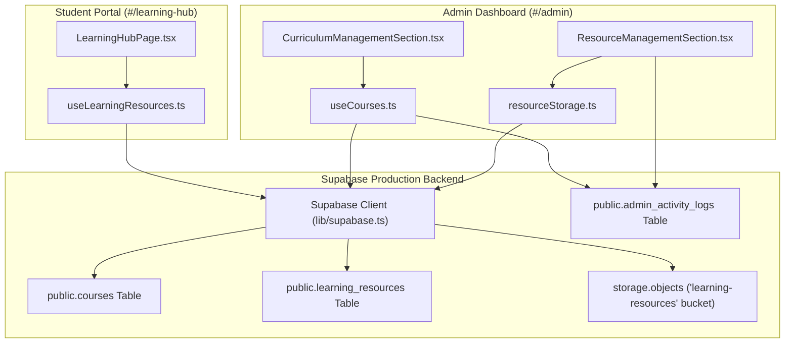

# UPSA IT Studies Platform — Learning Hub Audit Report

**Date**: September 30, 2026  
**Scope**: Student-facing `/learning-hub` & Admin Learning Management (`#admin` dashboard)  
**Target Environment**: Production (`https://kvkztsraiowardknkzmz.supabase.co`)  
**Audit Type**: READ-ONLY Architectural & Telemetry Verification  

---

## 1. Executive Summary

The Learning Hub is a production-ready academic material management and distribution portal built for undergraduate Information Technology students at UPSA. It features a complete database schema (`courses` and `learning_resources`) with Row Level Security (RLS) policies, administrative CRUD controls, deterministically organized file storage routines, and an intuitive dark-themed student repository interface. The live production database currently holds 46 seeded curriculum courses (39 required and 7 electives) with zero active schema errors. The overall feature completion rate is calculated at **72.4%** based on an assessment of 20 core student, admin, and platform capabilities.

$$\text{Completion Rate} = \frac{\text{Student (6.5/9)} + \text{Admin (3.5/5)} + \text{Platform (4.5/6)}}{20} = \frac{14.5}{20} = 72.5\%$$

---

## 2. Architecture & Data Flow

---

## 3. File Inventory

| Component / Layer | File Path | Primary Responsibility |
| :--- | :--- | :--- |
| **Student UI** | [`src/pages/LearningHubPage.tsx`](file:///C:/Users/Rich_Hajia/.gemini/antigravity/scratch/upsa-it-platform/src/pages/LearningHubPage.tsx) | Level tabs, semester/type filters, search bar, course grid, and resource detail modal. |
| **Admin Curriculum UI** | [`src/components/admin/CurriculumManagementSection.tsx`](file:///C:/Users/Rich_Hajia/.gemini/antigravity/scratch/upsa-it-platform/src/components/admin/CurriculumManagementSection.tsx) | Create, edit, toggle active status, and delete curriculum courses. |
| **Admin Resource UI** | [`src/components/admin/ResourceManagementSection.tsx`](file:///C:/Users/Rich_Hajia/.gemini/antigravity/scratch/upsa-it-platform/src/components/admin/ResourceManagementSection.tsx) | Upload materials, link external URLs, edit metadata, publish/unpublish, and remove files. |
| **Course Data Hook** | [`src/hooks/useCourses.ts`](file:///C:/Users/Rich_Hajia/.gemini/antigravity/scratch/upsa-it-platform/src/hooks/useCourses.ts) | Queries `public.courses`, sorts by level/semester/display order, handles upserts, status toggles, and activity logging. |
| **Hub Resource Hook** | [`src/hooks/useLearningResources.ts`](file:///C:/Users/Rich_Hajia/.gemini/antigravity/scratch/upsa-it-platform/src/hooks/useLearningResources.ts) | Queries active courses and published learning resources; auto-refreshes on window focus / hash change. |
| **Storage Utilities** | [`src/utils/resourceStorage.ts`](file:///C:/Users/Rich_Hajia/.gemini/antigravity/scratch/upsa-it-platform/src/utils/resourceStorage.ts) | Deterministic path generator (`<level>/semester-<sem>/<course>/<type>/<token>_<filename>`), size (50MB) and MIME type validation, bucket check, replacement, and deletion routines. |
| **TypeScript Definitions** | [`src/types/index.ts`](file:///C:/Users/Rich_Hajia/.gemini/antigravity/scratch/upsa-it-platform/src/types/index.ts) | Defines `Course`, `CourseType`, `LearningResource`, `ResourceType`, and `AdminActivityLog` interfaces. |
| **Supabase Client** | [`src/lib/supabase.ts`](file:///C:/Users/Rich_Hajia/.gemini/antigravity/scratch/upsa-it-platform/src/lib/supabase.ts) | Supabase JS client with custom fetch wrapper adding `no-cache` headers for GET requests. |
| **Curriculum Schema SQL** | [`src/lib/learning_hub_schema_and_curriculum.sql`](file:///C:/Users/Rich_Hajia/.gemini/antigravity/scratch/upsa-it-platform/src/lib/learning_hub_schema_and_curriculum.sql) | Table creation, indexes, RLS policies, and 46-course idempotent seed script. |
| **Storage Schema SQL** | [`src/lib/learning_resources_storage_schema.sql`](file:///C:/Users/Rich_Hajia/.gemini/antigravity/scratch/upsa-it-platform/src/lib/learning_resources_storage_schema.sql) | Bucket provisioning script for `learning-resources` with RLS policies on `storage.objects`. |

---

## 4. Feature Completeness Matrix

### Student-Facing Features (`/learning-hub`)

| Feature | Status | Evidence / Location |
| :--- | :---: | :--- |
| Browse curriculum by Level 100–400 & Semesters 1–2 | **DONE** | [`LearningHubPage.tsx:L162-L192`](file:///C:/Users/Rich_Hajia/.gemini/antigravity/scratch/upsa-it-platform/src/pages/LearningHubPage.tsx#L162-L192) & [`L215-L226`](file:///C:/Users/Rich_Hajia/.gemini/antigravity/scratch/upsa-it-platform/src/pages/LearningHubPage.tsx#L215-L226) |
| Required vs. Elective display & group pills | **DONE** | [`LearningHubPage.tsx:L311-L320`](file:///C:/Users/Rich_Hajia/.gemini/antigravity/scratch/upsa-it-platform/src/pages/LearningHubPage.tsx#L311-L320) & [`L329-L333`](file:///C:/Users/Rich_Hajia/.gemini/antigravity/scratch/upsa-it-platform/src/pages/LearningHubPage.tsx#L329-L333) |
| Unified multi-field search and resource filtering | **DONE** | [`LearningHubPage.tsx:L38-L74`](file:///C:/Users/Rich_Hajia/.gemini/antigravity/scratch/upsa-it-platform/src/pages/LearningHubPage.tsx#L38-L74) (`useMemo` query check) |
| Course detail modal with resources by type | **DONE** | [`LearningHubPage.tsx:L367-L511`](file:///C:/Users/Rich_Hajia/.gemini/antigravity/scratch/upsa-it-platform/src/pages/LearningHubPage.tsx#L367-L511) |
| File opening / external links / video links | **PARTIAL** | Opens `fileUrl`/`externalUrl` in new tab (`target="_blank"`); no inline video modal. |
| Resource metadata badges (year, duration) | **PARTIAL** | Displays `resourceYear` and `duration` badges ([`LearningHubPage.tsx:L449-L461`](file:///C:/Users/Rich_Hajia/.gemini/antigravity/scratch/upsa-it-platform/src/pages/LearningHubPage.tsx#L449-L461)); thumbnail rendering omitted. |
| Loading, error, and empty state indicators | **DONE** | [`LearningHubPage.tsx:L275-L290`](file:///C:/Users/Rich_Hajia/.gemini/antigravity/scratch/upsa-it-platform/src/pages/LearningHubPage.tsx#L275-L290) |
| Mobile responsiveness & accessibility | **PARTIAL** | Dark-themed responsive grid; no direct URL hash per course e.g., `#learning-hub?course=BITM104`. |
| Course outline PDF download | **PARTIAL** | `course_outline_url` stored in database but CTA button omitted from student UI. |

### Admin-Facing Features (`#admin`)

| Feature | Status | Evidence / Location |
| :--- | :---: | :--- |
| Course creation, editing, deactivation & group setup | **DONE** | [`CurriculumManagementSection.tsx:L63-L121`](file:///C:/Users/Rich_Hajia/.gemini/antigravity/scratch/upsa-it-platform/src/components/admin/CurriculumManagementSection.tsx#L63-L121) & [`useCourses.ts:L89-L168`](file:///C:/Users/Rich_Hajia/.gemini/antigravity/scratch/upsa-it-platform/src/hooks/useCourses.ts#L89-L168) |
| Resource file upload, replacement & storage cleanup | **DONE** | [`ResourceManagementSection.tsx:L160-L349`](file:///C:/Users/Rich_Hajia/.gemini/antigravity/scratch/upsa-it-platform/src/components/admin/ResourceManagementSection.tsx#L160-L349) & [`resourceStorage.ts:L98-L200`](file:///C:/Users/Rich_Hajia/.gemini/antigravity/scratch/upsa-it-platform/src/utils/resourceStorage.ts#L98-L200) |
| Resource publish/unpublish toggle | **DONE** | [`ResourceManagementSection.tsx:L298-L320`](file:///C:/Users/Rich_Hajia/.gemini/antigravity/scratch/upsa-it-platform/src/components/admin/ResourceManagementSection.tsx#L298-L320) |
| Bulk actions & drag-and-drop ordering | **NOT STARTED** | Single resource actions supported; bulk publish/delete UI not implemented. |
| Permission gating & audit logging | **DONE** | Calls `logAdminActivity` for all CRUD actions ([`ResourceManagementSection.tsx:L282`](file:///C:/Users/Rich_Hajia/.gemini/antigravity/scratch/upsa-it-platform/src/components/admin/ResourceManagementSection.tsx#L282)). |

### Platform & Infrastructure

| Feature | Status | Evidence / Location |
| :--- | :---: | :--- |
| Database schema & performance indexes | **DONE** | [`learning_hub_schema_and_curriculum.sql`](file:///C:/Users/Rich_Hajia/.gemini/antigravity/scratch/upsa-it-platform/src/lib/learning_hub_schema_and_curriculum.sql); 7 indexes on `courses` & `learning_resources`. |
| Database RLS policies | **DONE** | Public read active/published, authenticated admin write all. |
| Storage bucket & storage RLS policies | **PARTIAL** | [`learning_resources_storage_schema.sql`](file:///C:/Users/Rich_Hajia/.gemini/antigravity/scratch/upsa-it-platform/src/lib/learning_resources_storage_schema.sql) defined; client-side fallback `ensureResourceBucketExists()` active. |
| File size & MIME type validation | **DONE** | 50MB limit & whitelist in [`resourceStorage.ts:L74-L92`](file:///C:/Users/Rich_Hajia/.gemini/antigravity/scratch/upsa-it-platform/src/utils/resourceStorage.ts#L74-L92). |
| PostgREST schema cache invalidation | **DONE** | Custom `Cache-Control: no-cache` headers in [`lib/supabase.ts:L19-L23`](file:///C:/Users/Rich_Hajia/.gemini/antigravity/scratch/upsa-it-platform/src/lib/supabase.ts#L19-L23). |
| Resource analytics & download counters | **NOT STARTED** | Download events are not tracked in `site_analytics`. |

---

## 5. Live Data Check Results

Telemetric query executed against production Supabase instance (`kvkztsraiowardknkzmz.supabase.co`):

| Telemetry Metric | Measured Value | Target Expectation | Status |
| :--- | :---: | :---: | :---: |
| `public.courses` total rows | **46** | 46 | ✅ Match |
| Required courses count | **39** | 39 | ✅ Match |
| Elective courses count | **7** | 7 | ✅ Match |
| `public.learning_resources` total rows | **0** | 0 (New schema) | ℹ️ Ready for uploads |
| Courses with 0 resources | **46** | 46 | ℹ️ Expected |
| Storage bucket `learning-resources` | Defined | Public, 50MB limit | ℹ️ Needs SQL script run |

---

## 6. Phases Completed

| Phase | Name | Scope & Deliverables | Status | Evidence |
| :---: | :--- | :--- | :---: | :--- |
| **4.1** | **Database Schema & Curriculum Seed** | Created `courses` and `learning_resources` tables, indexes, RLS policies, and seeded 46 BSc ITM courses. | **COMPLETE** | Commit `6e42562` [`learning_hub_schema_and_curriculum.sql`](file:///C:/Users/Rich_Hajia/.gemini/antigravity/scratch/upsa-it-platform/src/lib/learning_hub_schema_and_curriculum.sql) |
| **5.0** | **Resource Management & Storage Layer** | Student `/learning-hub` UI, admin Curriculum & Resource management sections, and Supabase Storage upload utility. | **COMPLETE** | Commit `e1bee31`, `07ff7df` [`ResourceManagementSection.tsx`](file:///C:/Users/Rich_Hajia/.gemini/antigravity/scratch/upsa-it-platform/src/components/admin/ResourceManagementSection.tsx) |

---

## 7. Remaining Roadmap

| Phase | Name | Goal & Primary Tasks | Files Touched | Effort | Risk |
| :---: | :--- | :--- | :--- | :---: | :---: |
| **5.1** | **Storage SQL Execution & Initial Material Seeding** | Run `learning_resources_storage_schema.sql` in Supabase SQL Editor and seed initial past examination questions and course slides. | [`learning_resources_storage_schema.sql`](file:///C:/Users/Rich_Hajia/.gemini/antigravity/scratch/upsa-it-platform/src/lib/learning_resources_storage_schema.sql) | **S** | Low |
| **5.2** | **Deep Linking, Course Outlines & Video Player** | Add URL query parameter state sync (`#learning-hub?course=BITM104`), display course outline download button, and add inline video modal for video materials. | [`LearningHubPage.tsx`](file:///C:/Users/Rich_Hajia/.gemini/antigravity/scratch/upsa-it-platform/src/pages/LearningHubPage.tsx) [`hashRouter.ts`](file:///C:/Users/Rich_Hajia/.gemini/antigravity/scratch/upsa-it-platform/src/utils/hashRouter.ts) | **M** | Low |
| **5.3** | **Download Analytics & Admin Bulk Operations** | Track resource access events in `site_analytics` and add multi-select batch operations (bulk publish/delete) in the Admin panel. | [`ResourceManagementSection.tsx`](file:///C:/Users/Rich_Hajia/.gemini/antigravity/scratch/upsa-it-platform/src/components/admin/ResourceManagementSection.tsx) [`analyticsTracker.ts`](file:///C:/Users/Rich_Hajia/.gemini/antigravity/scratch/upsa-it-platform/src/lib/analyticsTracker.ts) | **M** | Low |

---

## 8. Issues and Technical Findings

| Severity | Issue Description | Location | Recommended Fix |
| :---: | :--- | :--- | :--- |
| **MEDIUM** | Storage Bucket SQL script not yet executed directly on production database engine. | [`src/lib/learning_resources_storage_schema.sql`](file:///C:/Users/Rich_Hajia/.gemini/antigravity/scratch/upsa-it-platform/src/lib/learning_resources_storage_schema.sql) | Execute `learning_resources_storage_schema.sql` in Supabase SQL Editor. |
| **LOW** | `course_outline_url` stored in `courses` table is missing a CTA button in the student modal. | [`src/pages/LearningHubPage.tsx`](file:///C:/Users/Rich_Hajia/.gemini/antigravity/scratch/upsa-it-platform/src/pages/LearningHubPage.tsx#L372-L412) | Add a "Download Course Outline" link in the modal header if `selectedCourse.courseOutlineUrl` exists. |
| **LOW** | Direct course shareability via URL hash is missing. | [`src/utils/hashRouter.ts`](file:///C:/Users/Rich_Hajia/.gemini/antigravity/scratch/upsa-it-platform/src/utils/hashRouter.ts) | Support `#learning-hub?course=<code_or_id>` deep linking. |
| **LOW** | Video resources open in an external tab rather than an embedded viewer modal. | [`src/pages/LearningHubPage.tsx`](file:///C:/Users/Rich_Hajia/.gemini/antigravity/scratch/upsa-it-platform/src/pages/LearningHubPage.tsx#L473-L483) | Add an inline modal with an HTML5 `<video>` or iframe player when `resourceType === 'video'`. |

---

## 9. Recommended Next 3 Actions

1. **Run Storage SQL Migration**: Execute [`src/lib/learning_resources_storage_schema.sql`](file:///C:/Users/Rich_Hajia/.gemini/antigravity/scratch/upsa-it-platform/src/lib/learning_resources_storage_schema.sql) in the Supabase SQL Editor for `kvkztsraiowardknkzmz` to explicitly provision the `learning-resources` bucket and RLS policies.
2. **Seed Initial Past Questions & Slides**: Upload sample PDF slides and past examination questions for Level 100 and Level 200 IT courses via the Admin panel (`#admin` -> Learning Resources).
3. **Add Course Outline CTA & Deep Linking**: Update [`src/pages/LearningHubPage.tsx`](file:///C:/Users/Rich_Hajia/.gemini/antigravity/scratch/upsa-it-platform/src/pages/LearningHubPage.tsx) to render course outline downloads and support course-specific URL sharing.
